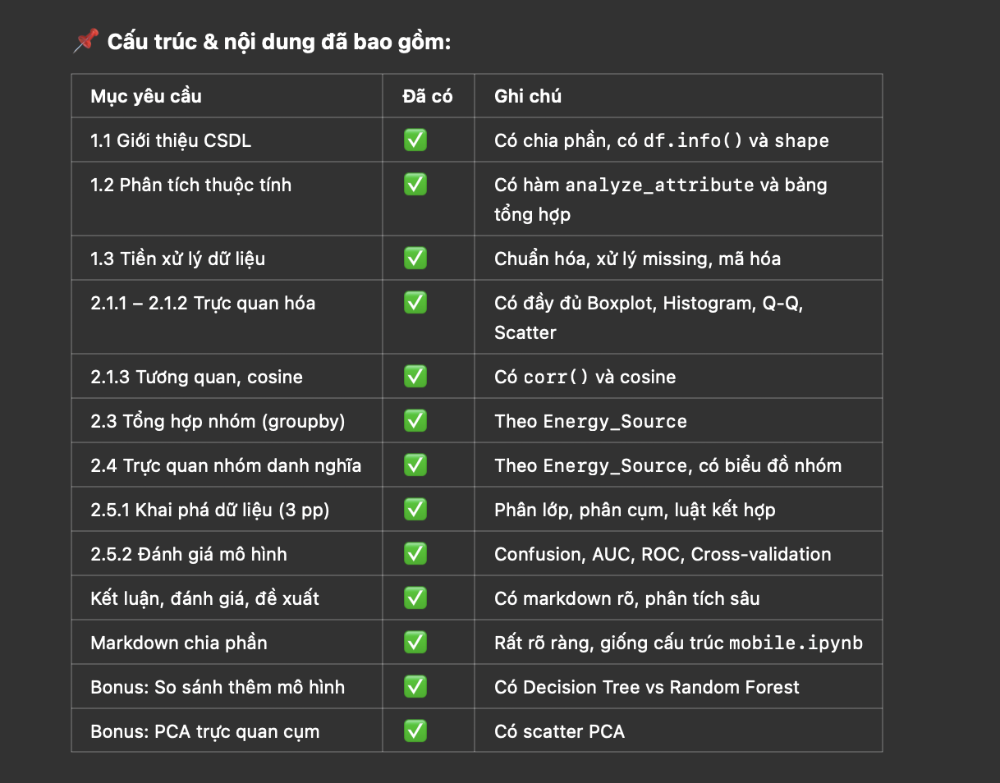

# Renewable Energy Data Analysis 📊⚡

Phân tích dữ liệu về tiêu thụ và hiệu quả năng lượng tái tạo sử dụng Python và Jupyter Notebook.

---

## 📁 Clone project từ GitHub

```bash
git clone https://github.com/baolamabcd13/jupyter_lmt.git
cd jupyter_lmt
```

---

## 🧪 Tạo môi trường ảo trên Windows

### 1. Tạo môi trường ảo:

```bash
python -m venv venv
```

### 2. Kích hoạt môi trường ảo:

```bash
venv\Scripts\activate
```

> Sau khi kích hoạt thành công, bạn sẽ thấy dòng lệnh bắt đầu bằng `(venv)`

---

## 📦 Cài đặt thư viện cần thiết

Sau khi môi trường ảo được kích hoạt, chạy:

```bash
pip install -r requirements.txt
```

---

## 🚀 Chạy Jupyter Notebook

Sau khi cài đặt xong thư viện, chạy:

```bash
jupyter notebook
```

Sau đó mở file `renew_final_advanced_sorted.ipynb` để xem và chạy toàn bộ project.

---

## 📚 Thư viện sử dụng chính

- `pandas`
- `numpy`
- `matplotlib`
- `seaborn`
- `scikit-learn`
- `scipy`
- `jupyter`

---

## 📌 Cấu trúc & nội dung đã bao gồm:

## 

## 📘 BÁO CÁO ĐỀ TÀI CÁ NHÂN

**Môn học:** Kho Dữ Liệu và Khai Phá Dữ Liệu  
**Học kỳ:** [Điền học kỳ]  
**Họ và tên:** [Tên sinh viên]  
**Mã số sinh viên:** [MSSV]  
**Tên đề tài:** Phân tích dữ liệu năng lượng tái tạo

---

## 📌 PHẦN 1: GIỚI THIỆU VỀ CƠ SỞ DỮ LIỆU

### 1.1. Tổng quan về CSDL

- Chủ đề, nguồn gốc dữ liệu
- Số lượng bản ghi, thuộc tính
- Mục đích sử dụng

### 1.2. Giới thiệu từng thuộc tính

- Tên thuộc tính, kiểu dữ liệu, ý nghĩa
- Số lượng null, unique
- Thống kê: mean, median, mode, min, max, Q1, Q3 (nếu là số)
- Phân bố & mode (nếu là danh nghĩa, nhị phân)

### 1.3. Tiền xử lý dữ liệu

- Mã hóa, chuẩn hóa
- Xử lý outlier (IQR)
- Ghi log các bước đã thực hiện

---

## 📊 PHẦN 2: PHÂN TÍCH – THỐNG KÊ DỮ LIỆU

### 2.1. Tìm hiểu dữ liệu

#### 2.1.1. Vẽ biểu đồ trực tiếp

- Boxplot (3 thuộc tính)
- Q-Q Plot (2 thuộc tính)
- Histogram (2 thuộc tính)
- Scatter plot (2 thuộc tính)

#### 2.1.2. Nhóm theo thuộc tính danh nghĩa (vd: `Energy_Source`)

- Boxplot theo nhóm
- Histogram theo nhóm

#### 2.1.3. Đo lường tương đồng

- Chọn 4 thuộc tính: nominal, binary, numeric, ordinal
- Tính ma trận tương quan
- Độ đo Cosine
- Nhận xét và so sánh

---

### 2.2. Tiền xử lý dữ liệu (bằng Python)

- Mã hóa, chuẩn hóa, xử lý dữ liệu thiếu

### 2.3. Tổng hợp dữ liệu

- Theo nhóm: loại năng lượng, vùng miền, mức thu nhập,...
- Trình bày bảng/tổng kết

### 2.4. Trực quan hóa dữ liệu

- Bar chart, Line chart, Heatmap,...

---

## 🧠 PHẦN 2.5: KHAI PHÁ DỮ LIỆU

### 2.5.1. Thực hiện khai phá

- Phân lớp (Decision Tree, Random Forest)
- Phân cụm (KMeans, trực quan PCA)

### 2.5.2. Đánh giá kết quả

- Confusion Matrix, Precision, Recall, F1-score
- ROC Curve, AUC
- Cross-validation
- Nhận xét so sánh mô hình

---

## ✅ PHẦN 3: KẾT LUẬN VÀ ĐỀ XUẤT

- Tổng kết những gì đã làm được
- Hạn chế, điểm mạnh/yếu mô hình
- Đề xuất cải tiến: mô hình mới, dữ liệu mới
- Ý nghĩa thực tiễn của đề tài

---

## 📚 TÀI LIỆU THAM KHẢO

- Kaggle / World Bank / Human Development Reports
- Documentation các thư viện Python
- Sách giảng dạy môn học
